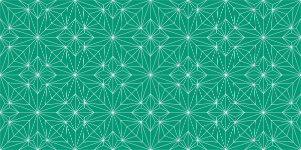

Emeralds
========

Geometric tiles from <http://www.annederian.com/EMERALDS>.

```haskell
import IHaskell.Display
import IHaskell.Display.Rlangqq hiding ((.-.))
import Diagrams.Prelude
import Diagrams.Backend.Cairo

a, b, c, d, e, f, g, h :: P2
a = 12 ^& (-12)
b = 0 ^& 0
c = (-12) ^& (-12)
d = (-6) ^& (-6)
e = 3 ^& (-3)
f = 7 ^& (-7)
g = 0 ^& (-12)
h = (-6) ^& (-9)

-- Lines
de = d ~~ e
df = d ~~ f
da = d ~~ a
dg = d ~~ g
dh = d ~~ h
ch = c ~~ h
gh = g ~~ h

-- 1/8 of a full tile
q0 = mconcat [de, df, da, dg, dh, ch, gh]

-- The X
x = ((-12) ^& (-12)) ~~ (12 ^& 12) <> ((-12) ^& 12) ~~ (12 ^& (-12))

diagram $ pad 1.05 $ position (zipWith (\p name -> (p, text [name])) [a, b, c, d, e, f, g, h] ['a'..]) <> q0 <> (x <> square 24) # lwG 0.01
```


Single tile
-----------

```haskell
q1 = reflectAbout b (c .-. b) q0
q2 = reflectAbout b (a .-. b) q0
q3 = reflectAbout b (a .-. b) q1
q = mconcat [q0, q1, q2, q3]

tile = (q <> x) # lwG 0.2 <> square 24 # lwG 0.1
diagram tile
```


Monochrome pattern
------------------

```haskell
tile4 = let tile2 = tile ||| reflectX tile in tile2 === reflectY tile2
tile16 = (tile4 ||| tile4)
                ===
         (tile4 ||| tile4)

diagram tile16
```


Emerald pattern
---------------

```haskell
import Data.Colour.SRGB

emerald = sRGB24 1 152 117  -- http://www.signature9.com/living/home/emerald-pantone-color-2013
style = bg emerald # lc white

diagram $ (tile16 ||| tile16) # style
```



